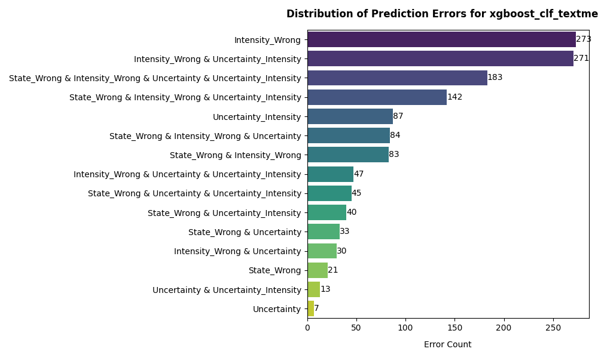
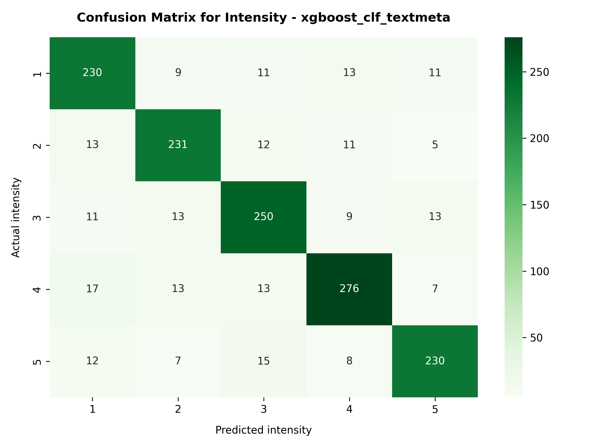
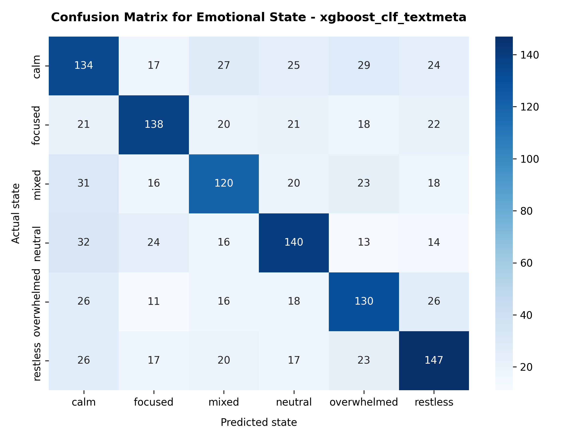

# Error Analysis & Model Evaluation

## 1. The Accuracy Ceiling (Aleatoric Uncertainty)

Our analysis across 1,440 training records revealed a consistent pattern of misclassifications that perfectly illustrate the inherent subjectivity of self-reported emotional data.

### Model Error Distribution

### Model Classification Matrix

The major errors are in the intensity prediction, with a significant number of misclassifications to intensity of 4 and 5.

## 2. Typology of Failures

### Category A: Intensity Miscalibration (The Subjectivity Gap)

The model correctly identifies the core emotion, but fails to match the user's highly subjective internal rating scale. Text that seems mild to the model is rated as extreme by the user, and vice versa.

**1. The "Understatement" Error**

- **Text:** `"still a bit off tbh"`
- **Actual:** Mixed (5) | **Predicted:** Mixed (1)
- **Insight:** The phrasing "a bit off" is linguistically low-intensity, so the model predicted a `1`. The user, however, felt a maximum intensity `5`.

**2. The "Text and Emotion" Conflict**

- **Text:** `"I guess could focus for a while."`
- **Actual:** Restless (4) | **Predicted:** Calm (2)
- **Insight:** The user wrote about focusing, but labeled themselves as `Restless 4`. The model predicted `Calm` due to the positive text.

**3. The "Calm but Overwhelmed" Paradox**

- **Text:** `"kinda calm now"`
- **Actual:** Overwhelmed (2) | **Predicted:** Overwhelmed (4)
- **Insight:** The text explicitly says "calm," yet the actual labeled state is "Overwhelmed." The model successfully detected the overwhelm (likely due to Sleep = 5.0, Stress = 4), but overshot the intensity.

### Category B: State Ambiguity (Sparsity & Generic Text)

When users leave generic, ultra-short journal entries, the TF-IDF vectorizer lacks the vocabulary necessary to anchor the prediction, forcing the model to guess based on overlapping metadata.

**5. The "Fine" Trap**

- **Text:** `"it was fine"`
- **Actual:** Restless (5) | **Predicted:** Calm (5)
- **Insight:** "It was fine" is a generic positive/neutral sentiment. The model predicted `Calm 5`, completely missing the user's internal `Restless 5` state, which was invisible in the text.

**6. Empty Context**

- **Text:** `"okay session"`
- **Actual:** Overwhelmed (3) | **Predicted:** Restless (3)
- **Insight:** With almost zero text data, the model relied on the biometrics (Sleep = 4.0, Stress = 5). High stress and low sleep logically point to "Restless", but the user was actually "Overwhelmed".

**7. Semantic Overlap (Neutral vs. Calm)**

- **Text:** `"back to normal after ..."`
- **Actual:** Neutral (1) | **Predicted:** Calm (1)
- **Insight:** "Normal" operates on the exact boundary between Neutral and Calm. The model chose Calm, which is practically a semantic tie.

**8. Semantic Overlap (Restless vs. Overwhelmed)**

- **Text:** `"mind was all over teh place ..."`
- **Actual:** Restless (3) | **Predicted:** Overwhelmed (3)
- **Insight:** Having a scattered mind is a symptom of both restlessness and overwhelm. The model predicted Overwhelmed, which is a highly reasonable (yet technically incorrect) guess.

### Category C: Complex / Multi-Part Emotions (Total Misses)

When a user describes a shifting emotional state, the model struggles to determine which part of the sentence represents the final emotion.

**9. The Mid-Entry Shift**

- **Text:** `"during the session helped me plan my day. later it changed kept thinking about work."`
- **Actual:** Focused (4) | **Predicted:** Neutral (2)
- **Insight:** The user starts "focused" (planning), but ends "anxious/neutral" (thinking about work). The model averaged this out to `Neutral 2`, missing the user's `Focused 4` label.

**10. The False Anchor**

- **Text:** `"for a while i was steady but nothing major. cafe ambience weirdly helped."`
- **Actual:** Neutral (2) | **Predicted:** Focused (4)
- **Insight:** The word "steady" heavily anchored the model to predict `Focused`. However, the user appended "but nothing major", downgrading their own state to a mild `Neutral`.

## 3. Engineering Insights & Mitigation

These failure cases definitively prove that **we cannot extract 100% accurate ground truth from ambiguous or contradictory text.** Attempting to force the XGBoost model to memorize these highly subjective edge cases would result in severe overfitting. We flag any entry where the model is uncertain about the prediction and use the Decision Engine to recommend a safe, low-friction intervention. The model can be improved by leveraging a larger dataset with more diverse examples of emotional expressions and by incorporating user feedback to fine-tune the model's predictions.
